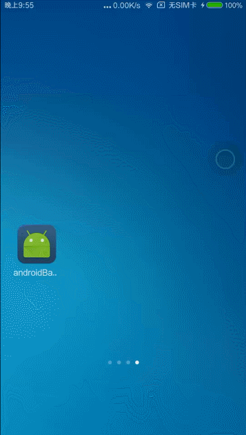
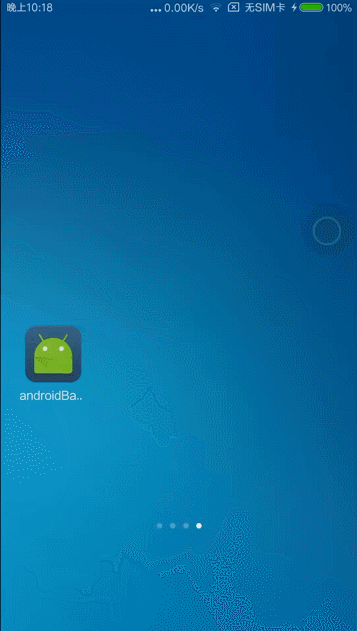

# androidBackFlow
a tool to control the view(activity and fragment) rollback flow

一个控制Android视图（即：activity与fragment）回退的工具。


## 简介
1. 这是一个链式回退多层视图的工具。
1. 这是一个在**single task && single process**环境中使用的工具。
2. 若app中有多个task或process，则只能在task或process之中使用，不能超过其中任何一个的范围。
3. task与task，task与process，process与process之间的回退功能，需要自己或系统去控制。
4. [若在task中有消耗过onActivityResult方法的情况，则BackFlow会失效。](#backflow不能使用的情况或不能回退到目标位置)


## 快速使用
0. 使用前：
    * 将App中所有的activity与fragment都继承于两个基础类（BaseBackFlowActivity与BaseBackFlowFragment）
    * 或将app的基础类继承于两个基础类（BaseBackFlowActivity与BaseBackFlowFragment）
    * 或在自己的基础类中@override startActivity与onActivityResult，并添加startActivity4NonBackFlow方法；
1. 结束该activity所属的task：
    * 若该App是单task的，则有结束App中所有的activity效果（finish该task中所有的activity，即退出了App）
    * 若在整个回退流程流程中，没有匹配到目标，也相当于finish_task的功能。
    * 若中间有onActivityResult方法被消耗，则会停留在最后一个被消耗的activity（因为setResult已无效）。
```java
BackFlow.finishTask(activity | fragment);
```

2. 返回到指定的activity（回退到指定的activity），若有多个activity实例，则只会回退到第一个匹配；
```java
BackFlow.request(activity | fragment, @NonNull Class<? extends Activity> atyClass)
```
3. 返回到指定的fragment列（回退到第一个匹配该fragment顺序列的activity，会调用fragments中最后一个fragment的onActivityResult）
```java
BackFlow.request(activity | fragment, @NonNull Class<? extends Fragment>... fragmentClazzs)
```

4. 返回到activity和fragment列都一致的activity（回退到包含了该fragment顺序列的activity，会调用fragments中最后一个fragment的onActivityResult）
```java
BackFlow.request(activity | fragment, @NonNull Class<? extends Activity> atyClass, @NonNull Class<? extends Fragment>... fragmentClazzs)
```

5. 若有额外参数，可以使用带Bundle参数的request方法
    * 传入额外参数
    ```java
    BackFlow.request(activity | fragment, @NonNull Bundle extra, @NonNull Class<? extends Activity> atyClass)
    ```
    * 判断是否有额外参数
    ```java
    BackFlow.hasExtra(Intent data)
    ```
    * 获取额外参数
    ```java
    BackFlow.getExtra(Intent data)
    ```
6. 也可以自己去使用Builder去构建BackFlow request
```java
BackFlow.builder(BackFlowType.back_to_fragments, FCSFSecondDFragment.this).setFragments(FcsfAFragment.class, FCSFSecondAFragment.class).create().request()
```


## tip
* fragment的sub fragment manager必须要是getChildFragmentManager
* BackFlow内部的Fragment是support-v4包中的，若app中使用的不是android.support.v4.app.Fragment，则可以将其替换为你自己的Fragment类型
* 若你内部的Fragment有多个基础类型(android.support.v4.app.Fragment, android.app.Fragment)，那你需要统一
* 若跳转目标View是Fragment，则该Fragment的ParentFragment是不会调用到onActivityResult方法的


## 内部实现
1. 利用startActivityForResult、onActivityResult、setResult与finish(activity)4四个方法，进行实现的；
2. 需要有两个基础类：BaseBackFlowActivity与BaseBackFlowFragment，所有的activity与fragment都需要继承于他们；
3. 需要@Override App中BaseBackFlowActivity与BaseBackFlowFragment两个类的startActivity方法，
    * 在内部实现中调用startActivityForResult方法，使得在BackFlow操作时，能串行链式的回退；
    ```java
    @Override
    public void startActivity(Intent intent) {
       startActivityForResult(intent, BackFlow.REQUEST_CODE);
    }
    ```
4. 需要@Override App中BaseBackFlowActivity的onActivityResult(requestCode, resultCode, data)方法，并在内部调用BackFlow.handle(this, resultCode, data)来进行回退操作的管理，并在目标位置结束继续调用onActivityResult方法；
    * tip: 不需要@Override BaseBackFlowFragment
    ```java
    @Override
    protected void onActivityResult(int requestCode, int resultCode, Intent data) {
       if (BackFlow.handle(this, getSupportFragmentManager().getFragments(), requestCode, resultCode, data)) {
           return;
       }
       super.onActivityResult(requestCode, resultCode, data);
    }
    ```
5. 调用BackFlow方法执行回退操作；
    * BackFlow操作内部会调用setResult与finish(activity)方法，用于链式回退；
    ```java
    static void request(@NonNull Activity activity, @NonNull Intent backFlowData) {
        activity.setResult(RESULT_CODE, backFlowData);
        activity.finish();
    }
    ```
    * 例如：退出当前的activity所属的task（finish该task中所有的activity）
        * **tip：有些情况会有影响: [BackFlow不能使用的情况或不能回退到目标位置](#backflow不能使用的情况或不能回退到目标位置)**
    ```java
    BackFlow.finishTask(activity | fragment)
    ```


## 代码简介
1. 主功能：BackFlowType
    * 共五个分类：error，finish_task，back_to_activity，back_to_fragments，back_to_activity_fragments
        * finish_task
            * 结束task：若该App是单task，则有结束App中所有的activity效果（finish该task中所有的activity）
            * 若在整个回退流程流程中，没有匹配到目标，也相当于finish_task的功能。
            * 若中间有onActivityResult方法被消耗，则会停留在最后一个被消耗的activity（因为setResult已无效）。
        * back_to_activity
            * 返回到指定的activity（回退到指定的activity），若有多个activity实例，则只会回退到第一个匹配；
        * back_to_fragments
            * 返回到指定的fragment列（回退到第一个匹配该fragment顺序列的activity）
        * back_to_activity_fragments
            * 返回到activity和fragment列都一致的activity（回退到包含了该fragment顺序列的activity）
        * error: 异常情况
            * onActivityResult方法参数data中data.getIntExtra(BACK_FLOW_TYPE, ERROR_BACK_FLOW_TYPE)，异常类型都返回该类型，且直接抛出异常；
2. 调用类：BackFlow
    * BackFlowType类的请求执行与处理的包装器，方便使用
    * 设置了默认RESULT_CODE值（Integer.MAX_VALUE）；
        * 这是回退功能的核心结构，所以其他业务操作的resultCode不能与其一样，否则会有错误；
    * 设置了默认的REQUEST_CODE值（0x0000ffff）；
        * override startActivity方法时调用的，防止不能触发onActivityResult方法
        * 其他的requestCode，不能与其一样，否则App内部业务逻辑可能有异常情况
        * tip: Can only use lower 16 bits for requestCode
    * request back flow：执行BackFlow操作的方法组
    * builder request param and get extra：builder BackFlow操作与BackFlow的额外数据
    * handle back flow：判断与处理BackFlow操作
    * back flow log
        * 打印Intent数据
        * 外提供日志接口
        * 可以使用"BackFlow-->"来进行日志过滤，查看BackFlow的数据流转
        * 也可以设置一个统一的日志开关，用于开启、禁止BackFlow日志
3. 基础类：BaseBackFlowActivity与BaseBackFlowFragment
    * 所有的activity与fragment都需要继承于他们；
    * 或者实现两个类的功能：
        * @Override 两个类的startActivity(intent)方法，并且在内部实现中调用startActivityForResult(intent, requestCode)方法，使得在BackFlow操作时，能串行的回退；
        ```java
        startActivityForResult(intent, BackFlow.REQUEST_CODE);
        ```
        * @Override BaseBackFlowActivity的onActivityResult(requestCode, resultCode, data)方法
            * 并在内部调用BackFlow.handle(this, getSupportFragmentManager().getFragments(), requestCode, resultCode, data)来进行回退操作的管理，
            * 并在目标位置结束继续调用BackFlow.request(activity, data)
4. BackFlow参数类：BackFlowParam
    * 执行BackFlow操作的参数类，共有6个参数
        * BackFlowType type：该BackFlow的类型，共有5个，其中error类型是不能使用的
        * Activity与backFlowData(Intent)：
            * 在执行BackFlow时需要这两个参数
            ```java
            public void request() {
                BackFlow.request(activity, backFlowData);
            }
            ```
            * Activity：在执行BackFlow时需要
            ```java
            static void request(@NonNull Activity activity, @NonNull Intent backFlowData) {
                activity.setResult(RESULT_CODE, backFlowData);
                activity.finish();
            }
            ```
            * backFlowData(Intent)：执行BackFlow的数据，由四个参数组成
                * type，atyClass，fragmentClazzs，extra
        * Class<? extends Activity> atyClass
            * BackFlow回退的目标activity
        * List<Class<? extends Fragment>> fragmentClazzs
            * 回退到该fragment的顺序列表，fragments顺序列中的目标fragment(**最后一个fragment**)
        * Bundle extra：额外的附加数据
    * Builder：Builder模式，减少创建backFlowData的复杂度
5. BackFlow Intent工具类：BackFlowIntent
    * 组装与解析BackFlow Intent的工具类，共有四个参数，app中其他的key不能与他们的key相同
        * BACK_FLOW_TYPE：回退功能的类型（BackFlowType.type）
            * type is int
            * ERROR_BACK_FLOW_TYPE: 异常错误类型的type值（BackFlowType.error.type）
            * 判断是否为BackFlow类型onActivityResult
            ```java
            private static boolean canHandle(int resultCode, Intent data) {
                return resultCode == RESULT_CODE && BackFlowType.isBackFlowType(data);
            }
            ```
        * BACK_FLOW_ACTIVITY：回退功能中指定的activity
            * type is String
        * BACK_FLOW_FRAGMENTS：回退功能中指定的fragment顺序列
            * type is String
            * 使用json进行格式化
        * BACK_FLOW_EXTRA：回退功能中用户带入的额外数据
            * type is String
            * 可以外带额外数据给目标的Activity或Fragment
    * Builder：Builder模式，减少创建BackFlow Intent的复杂度
6. BackFlow 视图工具类：BackFlowViewHelper
    * 匹配BackFlow中目标Activity与Fragment的工具类
    * isTargetActivity方法：是否为回退功能的目标activity
    * findTargetFragment方法：找到回退功能中fragments顺序列中的目标fragment(**最后一个fragment**)
    * tip: fragment的sub fragment manager必须要是getChildFragmentManager


## BackFlow不能使用的情况或不能回退到目标位置
1. 若在回退链中间有任何一个XXXActivity消耗过onActivityResult方法，则会停留在该XXXActivity，不能继续回退
    * 因为整个回退功能都是依赖于setResult方法将回退数据，链式的传递给前一个activity的onActivityResult方法，而在activity消耗了onActivityResult方法之后，是不会再调用该方法的。
2. 现在发现的消耗onActivityResult方法的情况有：
    * 切换task；
    * 切换process；
    * 在startActivity时，调用了intent.setFlags(Intent.FLAG_ACTIVITY_NEW_TASK);
3. launchMode
    * **不同的android版本，有不同的区别；4.4会消耗，5.0.2与6.0不会消耗**
    * singleInstance
        * 会启用一个新的栈结构，将Acitvity放置于这个新的栈结构中，并保证不再有其他Activity实例进入
        * 4.4会切换task
        * **5.0.2与6.0 startActivityForResult时不会切换task，所以仍然可以使用，不过这时launchMode将变为standard**
    * singleTask
        * 4.4会消耗onActivityResult方法
        * **5.0.2与6.0 startActivityForResult时不会回调onActivityResult，所以仍然可以使用，不过startActivityForResult方法，这时由于launchMode将变为standard**


## tips and limitations (提示与限制)
1. launchMode: startActivityForResult启动singleTop, singleTask, singleInstance的XXXActivity
    * 5.0之后的系统，则XXXActivity的launchMode设置失效，变为standard launchMode
    * 5.0之前的系统，只有singleTop模式失效
    * 所以，若有需求的话，则可以使用**startActivity4NonBackFlow**方法，不过这时候BackFlow将失效，将会停留在该处不再回退
2. startActivityForResult + Intent.FLAG_ACTIVITY_NEW_TASK + singleInstance，会启动一个新task，所以BackFlow将失效，将会停留在该处不再回退

